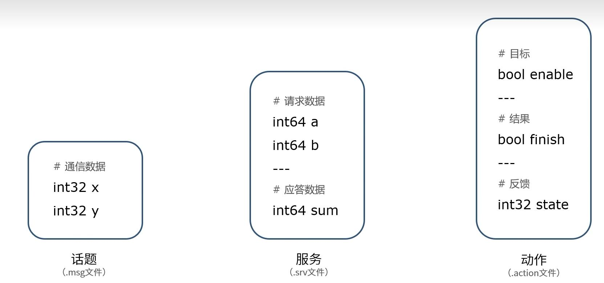
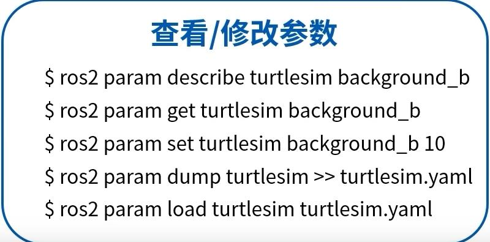

<!--

 * @Author: Aries-441 sjtu.liu.jj@gmail.com

 * @Date: 2022-11-08 13:04:07

 * @LastEditors: Please set LastEditors

 * @LastEditTime: 2022-11-08 20:16:22

 * @FilePath: /dev_ws/note.md

 * @Description: 这是默认设置,请设置`customMade`, 打开koroFileHeader查看配置 进行设置: https://github.com/OBKoro1/koro1FileHeader/wiki/%E9%85%8D%E7%BD%AE

-->

# 节点的编码流程：
1，编程接口初始化  
2，创建节点并初始化  
3，实现节点功能  
4，销毁节点并关闭接口  

# 话题topic
## 创建话题发布者流程： 
1，编程接口初始化  
2，创建节点并初始化 
3，创建发布者对象  
4，创建并填充话题消息  
5，发布话题消息  
6，销毁节点并关闭接口  

## 创建话题订阅者流程：
1，编程接口初始化  
2，创建节点并初始化  
3，创建订阅者对象  
4，回调函数处理话题数据  
5，销毁节点并关闭接口  

# 服务service
## 创建服务客户端程流程：
1，编程接口初始化  
2，创建节点并初始化  
3，创建客户端对象  
4，创建并发送请求数据  
5，等待服务器端应答数据  
6，销毁节点并关闭接口  

## 创建服务服务端流程：
1，编程接口初始化  
2，创建节点并初始化  
3，创建服务端对象  
4，通过回调函数处进行服务  
5，向客户端反馈应答结果  
6，销毁节点并关闭接口

# 动作action:完整行为的流程管理
##   

# 通信接口

# 参数：机器系统的全局字典
全局共享字典 由键和值组成 可实现动态监控

## 

